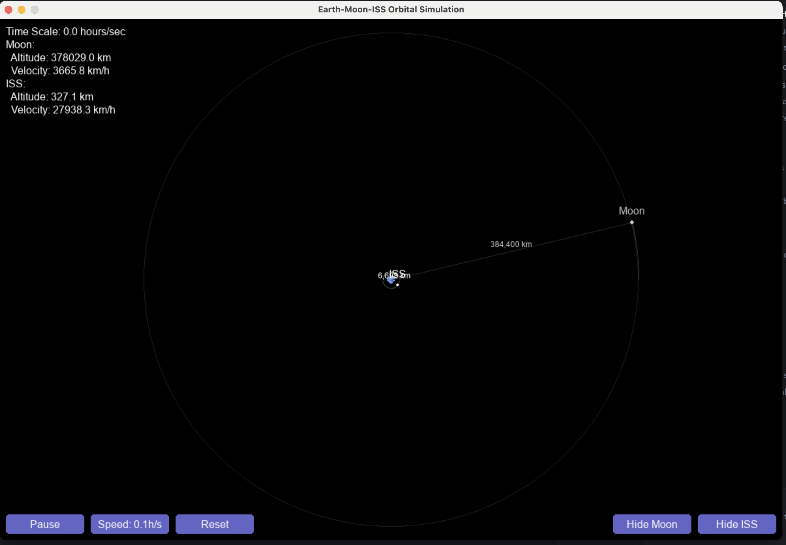

# Earth-Moon-ISS Orbital Simulation

A real-time simulation of the Earth-Moon-International Space Station (ISS) system using actual orbital parameters and Newtonian physics. The simulation provides an interactive visualization of these celestial bodies' orbits with proper scaling and time controls.



## Features

- Accurate orbital mechanics using Velocity Verlet integration
- Real-time visualization with proper scaling for both Moon and ISS orbits
- Interactive controls for simulation speed and visibility
- Distance indicators and trajectory paths
- Real-time information display (altitude, velocity)
- Configurable time scales (24 hours simulated in 30sec to 4min)

## Requirements

- Python 3.x
- Dependencies:
  - pygame==2.5.2
  - numpy==1.24.3
  - scipy==1.12.0

## Installation

1. Clone this repository:
   ```bash
   git clone <repository-url>
   cd orbit
   ```

2. (Optional) Create and activate a virtual environment:
   ```bash
   python -m venv .venv
   source .venv/bin/activate  # On Unix/macOS
   # OR
   .venv\Scripts\activate     # On Windows
   ```

3. Install dependencies:
   ```bash
   pip install -r requirements.txt
   ```

## Running the Simulation

Run the simulation using:
```bash
python run.py
```

## Controls

### GUI Controls
- **Play/Pause**: Toggle simulation running state
- **Speed**: Cycle through time scales
  - 24h in 4min (360x)
  - 24h in 2min (720x)
  - 24h in 1min (1440x)
  - 24h in 30sec (2880x)
- **Reset**: Reset bodies to their initial positions
- **Show/Hide Moon**: Toggle Moon visibility
- **Show/Hide ISS**: Toggle ISS visibility

### Keyboard Controls
- `ESC`: Quit the application

## Display Information

The simulation shows:
- Real-time altitude and velocity for visible bodies
- Distance indicators along connecting lines
- Current time scale
- Orbital trajectories
- Body labels

## Technical Details

### Physical Parameters
- Earth: Mass = 5.972×10²⁴ kg, Radius = 6,371 km
- Moon: Mass = 7.348×10²² kg, Orbital Radius ≈ 384,400 km
- ISS: Mass = 419,725 kg, Altitude ≈ 408 km

### Visualization
- Moon's orbit uses 95% of screen radius
- ISS uses 2x Moon's scale for better visibility
- Earth sized proportionally
- Trajectories limited to 1000 points for performance
- Frame rate capped at 60 FPS

## Project Structure

```
orbit/
├── src/                    # Source code
│   ├── physics/           # Orbital mechanics and constants
│   ├── visualization/     # Pygame rendering
│   └── ui/               # User interface controls
├── tests/                 # Test files
├── run.py                 # Entry point
└── requirements.txt       # Dependencies
```

## License

[Your License Here] 